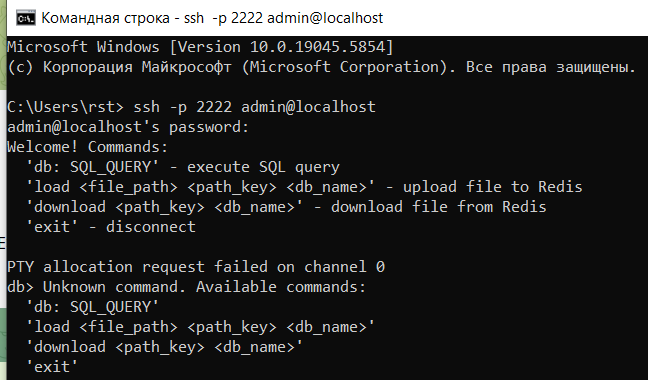

# Проект "Конcольный SSH клиент"

---

## Начальная информация

Для начала, что же такое SSH клиент? SSH (Secure Shell) — это сетевой протокол, который позволяет устанавливать безопасное соединение между клиентом и сервером, обычно для управления удалёнными системами, выполнения команд и передачи файлов. Консольный SSH клиент — это программа, которую вы можете использовать из командной строки (консоли) для подключения к удалённому серверу по протоколу SSH.

Проект реализирован на Python с использованием Docker и Redis.

## Реализация проекта:
- Жукова Екатерина
- Устинова Ирина
- Николаев Максим

## Техническое задание
- Подключение к серверу
- Выполнение команд
- Передача файлов
- Сохранение сессий
- Логирование
- Unit-тесты

---
## Возможности проекта
Данный проект позволяет:
- запускать свой собственный локальный сервер (используя контейнер докера)
- входить в свой аккаунт
- загружать файлы на сервер, хранить файлы на сервере, скачивать файлы с сервера
- сохранять логи сессий

## Запуск и полезная информация

1. Скопируйте все файлы проекта в одну папку
2. Убедитесь, что у вас установлены все необходимые для работы расширения (описаны в `requierements.txt`)
3. Убедитесь, что у вас установлен `Docker Desktop`
4. Запустите контейнер докера используя команды:
   - `docker build -t ssh-client`
   - `docker-compose up`
   - `ssh -p 2222 <Registered_Username>@localhost`

    Данные зарегистрированного пользователя:

    Логин: admin
    
    Пароль: 12345

### Доступные команды:
- `db: SQL_QUERY` - выполнить SQL запрос
- `load <file_path> <path_key> <db_name>` - загрузить файл в базу данных Redis
- `download <path_key> <db_name>` - скачать файл из базы данных
- `exit` - отключиться от сервера

